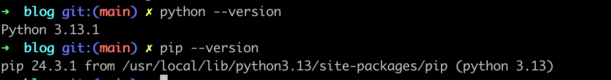
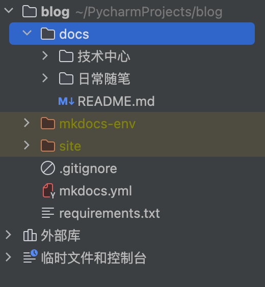

## 操作步骤

- 已安装python，pip，尽量为较新版本
  
- 创建自己的代码仓库
```
git@github.com:dtmcc/blog.git
```
- 安装 mkdocs
```
pip install mkdocs
```
- 创建一个 python项目



  - docs为 mkdocs 原始的md文件目录
  - site为 mkdocs 执行build命令后 生成的文件目录
  - 命令
    - 本地开发 mkdocs serve，访问：http://127.0.0.1:8000/ 可预览效果
    - 打包资源 mkdocs build，打包文件部署到自己服务器即可对外访问

## 进阶 CI/CD


